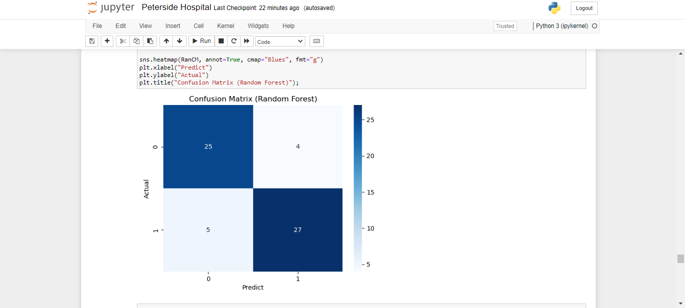

## Peterside_Hospital

🏥 Predicting the likelihood of heart disease is a crucial task in the medical field. As a Data Scientist, I developed a machine-learning model using supervised learning to predict the likelihood of a person having heart disease based on their health features.

The heart dataset including age, sex, chest pain type, blood pressure, cholesterol levels, and other relevant factors. Leveraging state-of-the-art facilities and modern equipment at Peterside Hospital, the model was trained on this data to make accurate predictions.

With this model, Peterside Hospital can proactively identify individuals at a higher risk of heart disease, allowing for early intervention and personalized treatment plans. This advancement in predictive analytics will enhance patient care and potentially save lives, further solidifying Peterside Hospital's reputation as a top-tier healthcare provider in the country. 🩺❤️ 

 

 

